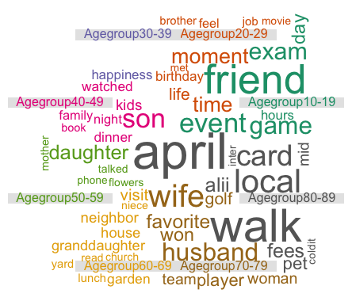

# Applied Data Science @ Columbia
## Fall 2018
## Project 1: What made you happy today?



### [Project Description](doc/)


Term: Fall 2018

+ Projec title: How people from different age groups differ in describing their happy moments
+ This project is conducted by Huiyu Zhang

+ Project summary: This project mainly analyzes how people from different age groups describes differently about their happy moments. The backgroud information of various age groups are also included, such as the age, country and gender distribution in different age groups.

This folder is orgarnized as follows.

```
proj/
├── lib/
├── data/
├── doc/
├── figs/
└── output/
```

Please see each subfolder for a README file.
